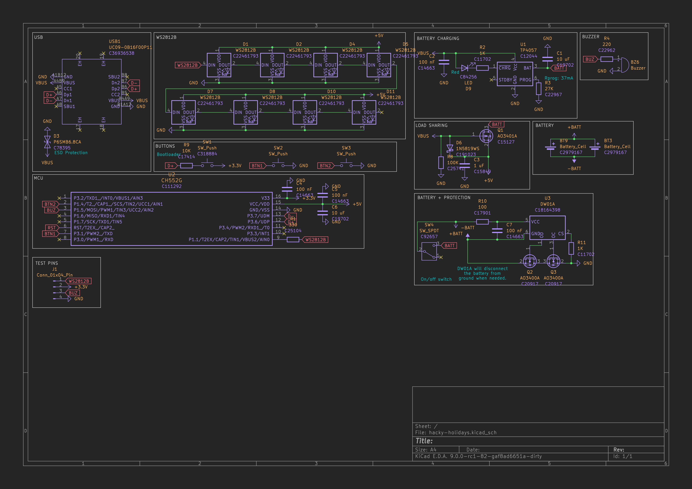
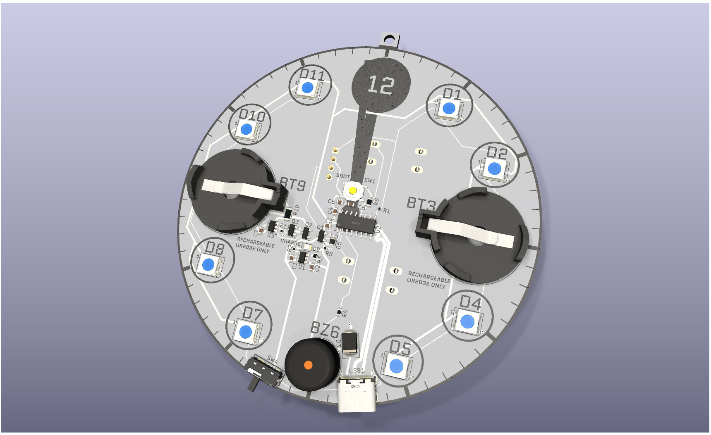

# The Pixel Clock

A clock-shaped PCB with 8 Neopixels and a buzzer. Built on a `CH552` MCU. Powered by two rechargeable LIR2032s.

Although this cannot actually be used as a clock, it can be used to play songs, with the neopixels flashing in sync.

Firmware using [ch554_sdcc](https://github.com/Blinkinlabs/ch554_sdcc) is in the firmware directory.

[gerber.zip](https://gerber.zip/2d/?boardUrl=%20https%3A%2F%2Fraw.githubusercontent.com%2Fgrimsteel%2Fpixel-clock%2Frefs%2Fheads%2Fmain%2Fproduction%2Fhacky-holidays.zip)

---

